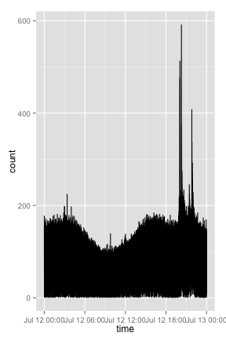

## First Steps 

First I started with:

1. Getting the Data of twitter
2. looking into the data (1,7 GB)
3. Find I need a prepreocessing -  couldn't do wihin R
4. Write a small programm reading and cleaning the raw dat in .NET Framework


---
## Data in R
Load and save Data


```r
library(ggplot2)
library(bit64)
df1 <- readRDS(file="plot_second.Rda")
df2 <- readRDS(file="plot_minute.Rda")
df3 <- readRDS(file="plot_hour.Rda")
```

---

## Working on the Data
The Data contained:

* TwitterID
* UserId
* Timestamp
* Latitude and Longitue
* Country or City
* Content of the Tweet

---
## Working on the Data
Count Number of tweets for ervery timestepp.

Sum up for every Minute and Hour.


```r
count  <- data.frame(table(dat$V3))
sumMinute <- c()
for(i in seq(1,length(count$Freq),60)){sumMinute <- append(sumMinute,sum(count$Freq[i:(i+60)]))}
sumHour <- c()
for(k in seq(1,length(count$Freq),3600)){sumHour <- append(sumHour,sum(count$Freq[k:(k+3600)]))}
realTime <- strptime(as.character(count$Var1),format="%Y%m%d%H%M%S")
```

---
## Plot Data
For ploting the Data I used ggplot

```r
df <- data.frame(realTime,Tweet.count)
ggplot(df,aes(x=realTime,y=Tweet.count)) + geom_line()
```

---
## Tweets per Second - Minute - Hour
Plot wiht different time resolutions

   
